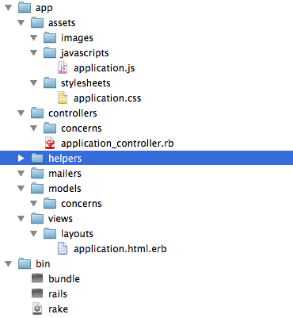
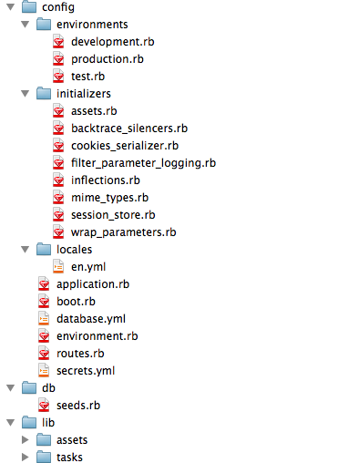

# Web Apps

"Web apps" can mean everything from interactive JavaScript to something that involves a server farm crunching numbers. We're going to use Python, Flask and SQLite to build an app that allows us to browse [this Guantanamo Bay detainee data](http://www.theguardian.com/world/datablog/2011/apr/25/guantanamo-bay-detainees-full-list#data).

## Flask

We used [Flask](http://flask.pocoo.org) for a tiny bit before, it's a lightweight web framework for Python. A **web framework** is, more or less, anything that allows you to more easily use a programming language with the web. Maybe it helps with figuring out URLs, or creating links, or keeping the visual part of your site organized, or a million other tasks.

When I say "lightweight", I mean that a Flask app might look like this:

    from flask import Flask
    app = Flask(__name__)

    @app.route('/')
    def hello_world():
        return 'Hello World!'

    if __name__ == '__main__':
        app.run(debug=True)

For comparison, maybe you've heard of [Ruby on Rails](http://rubyonrails.org). Rails is a web framework for the programming language Ruby. Let's look at *just part of the directory structure* of a freshly created Ruby on Rails project.

Insane, right? Smaller frameworks (aka microframeworks) are pretty awesome for non-enterprise apps (aka not you're a big professional company that will be running this service forever).

The Rails-level framework for Python is [Django](https://www.djangoproject.com), and the Flask-level framework for Ruby is [Sinatra](http://www.sinatrarb.com). There are also a million more but *you can google that yourself*.

## Setting up a Flask project

While you can put everything in your Flask project into a single file, it's most always better to organize it into multiple files - put your Python code over here, put your HTML templates over there, some other stuff somewhere else.

Our project is going to be called `gitmo`. Add a folder called `static` and another one called `templates`.

    gitmo/
      app.py
      static/
      templates/

`static` is for files that aren't dynamically generated, like images and .js files and the like.

`templates` is the templated versions of the dynamically generated web pages.

`app.py` is our application file. It should contain the following code:

    from flask import Flask
    app = Flask(__name__)

    @app.route('/')
    def index():
        return '<h1>Hello World!</h1>'

    if __name__ == '__main__':
        app.run(debug=True)

From terminal, in the `gitmo/` directory, run the command

    python app.py

Visit [http://127.0.0.1:5000](http://127.0.0.1:5000) on your computer and you should have a *running web app** that does nothing but act polite.

## Templates

### Basic Templates

So you know how we mashed up a bunch of HTML in the "Hello world" section? That's *horrid*, and we should be drawn and quartered for it. HTML belongs in an `.html` file, and we're going to put it there before anyone notices.

Add a file called `index.html` into your `templates` folder and have it contain the text `<h1>Hello world</h1>`. We're going to render that page instead of just sending back some text, which takes two changes:

Alter `app.py`'s `index` function to read as follows

    def index():
        return render_template('index.html')

Add a new `import` line to the top of `app.py`

    from flask import render_template

**Now refresh**. Cool, right? Let's change the code in `index.html` to allow us to select some countries to look at data from

    <h1>Detainee Country List</h1>

    
Only a few countries

    
<a href="/country/CN">China</a>

    
<a href="/country/LY">Libya</a>

    
<a href="/country/CA">Canada</a>

## Routing and parameters

Refresh your page, and click one of those links. What happens? Nothing good! It looks like the web server doesn't know what to do when we visit that URL.

### Routing

Figuring out what to do and where to go when a certain URL is visited is called **routing**, and you might have an inkling that `@app.route('/')` is in charge of that. And you'd be right!

Take a look at the routing code for the root of our web server:

    @app.route('/')
    def index():
        return render_template('index.html')
        
It defines a route for `/`, and executes `index()`. If we wanted to add a route for `/country/china` we *could* do something like this.

    @app.route('/country/CA')
    def china():
        return render_template('china.html')

Along with creating a `china.html` inside of the `templates/` directory. We can make `china.html` contain

    <h1>Detainees from China</h1>

    
There are 34 detainees from China

Refresh [the page](http://127.0.0.1:5000), click your ["China" link](http://127.0.0.1:5000/country/china) and see if it works! (It does!)

### Parameters

The problem is, what we just did is *real dumb*. If we wanted to make pages for a hundred countries, we're going to need a hundred functions? And a hundred routes? Horrible. Terrible. No-good very-bad.

Rename `china.html` to `country.html`

Change your country routing to be

    @app.route('/country/<abbreviation>')
    def show_country(abbreviation):
        return render_template('country.html')

**Refresh it.** Now maybe even try visiting [your "Libya" link](http://127.0.0.1./country/libya). What's that sound? Is it you complaining that the page still just talks about China? Good thing we can send variables to the template! Edit `app.py` with

    @app.route('/country/<abbreviation>')
    def show_country(abbreviation):
        return render_template('country.html', abbreviation=abbreviation)

to send the name variable to the template, and and `country.html` with

    <h1>Detainees from {{ abbreviation }}</h1>

    
There are 34 detainees from {{ abbreviation }}

And you'll be all set! Kind of.

### URL builders

Now let's look at those links in `index.html` once more.

    
<a href="/country/CN">China</a>

    
<a href="/country/LY">Libya</a>

    
<a href="/country/CA">Canada</a>

Looks so boring and HTML-ish. Don't you think there should be a more programming-y way to do it?

*There is!*

`url_for` is a bit of magic that takes a method (such as `show_country`) and lets you fill in the arguments (such as `name`). Try it out:

    
<a href="{{ url_for('.show_country', abbreviation='CN') }}">China</a>

    
<a href="{{ url_for('.show_country', abbreviation='LY') }}">Libya</a>

    
<a href="{{ url_for('.show_country', abbreviation='CA') }}">Canada</a>

The method gets a period in front of it, but it's pretty simple overall.

## Sqlite + Peewee

If only there were some sort of *base* where we could store all of our *data*. Now that would be something!

While we could write all of those `SELECT * FROM 'detainees' WHERE country='China'` kinds of SQL statements, instead we're going to use an **ORM** - Object-Relational Mapper. Instead of dealing with the database directly, we deal with a *thing* that represents each row in the database. In our case, we're going to have a lot of detainees.

### Creating the database

First, we need to take [our csv](data.csv) and convert it to Sqlite.

Open up a new database in the terminal by running `sqlite3 detainees.db`.

Type `.tables` to get a list of tables - there should be none so far.

Create a new `detainees` table by running the following code

    CREATE TABLE detainees ( 
      name CHAR,
      isn CHAR,
      nationality CHAR,
      iso CHAR,
      arrival_date CHAR,
      transfer_reason CHAR,
      capture_details CHAR
    );

And a new `countries` table by running the following code

    CREATE TABLE countries ( 
      name CHAR,
      iso CHAR
    );

Type `.tables` and hit enter to get a list of tables again - this time `detainees` and `countries` should be listed. Once you're sure your tables are there, type `.q` to exit.

Now you'll want to run `python import.py` - it'll open up `gitmo.csv` and import all the detainees into the database. If it runs silently that means things went well.

> **Update 3:** SQLite has this cool command called `.import` that mostly serves to poorly import data, ruin your database, and make you spend hours struggling. This is why people use MySQL.
> **Update 2**: Previously I made you stumble through some terrible Excel-exporting-csv + SQLite-importing-csv line-ending issues, but no longer. I've kept the info below for everyone's sake, but you won't need it. We're going to use `.import` to import the csv.
> **Update 1:** Do you get an error about a ton of extra columns? That's because SQLite is *refusing to acknowledge the line endings*.
> There are two kinds of line endings, LF (line feed, aka `\n`) and CR (carriage return, `\r`). *nix machines and OS X sticks to `\n`, while Windows uses `\r\n`. Excel for Mac is stupid and for some reason just uses `\r`, while SQLite likes the Windows style. You'll need to open your CSV in a text editor and convert the line endings if you want to survive!

To check that your data got in there, run `sqlite3 detainees.db` again, then `select name from detainees;` once you're at the sqlite prompt. Is it all there? Yes? It's all correct? ...scroll up, please. To the top.

Sqlite, in all its glory, also imported your header rows. Get rid of it with the following.

    DELETE FROM detainees WHERE name='Name';

> **NOTE** SQLite is also a pain in the ass about `NULL`/`None` values, in that it *pretends they're strings*. If you were importing anything with numbers in it that also happened to be empty, you'd need to run `UPDATE tablename SET colname=NULL WHERE colname='';`. If you don't do that you'll get all sorts of weird conversion errors later on in your app.

Now that our `detainee` table is good to go, we can use it to populate our `countries` table. Take a look at the difference between

    SELECT nationality,iso FROM detainees;
  
versus 
  
    SELECT DISTINCT nationality,iso FROM detainees;
  
That second one is what we want in `countries`, right? Let's go ahead and insert it right from that query

    INSERT INTO countries (name, iso) SELECT DISTINCT nationality,iso FROM detainees;

That query takes the output of the `SELECT DISTINCT...` query and pops it right into countries. Easier than making a second csv!

### Converting dates

So, back to `detainees`. What about those `arrival_date` columns?

    SELECT arrival_date FROM detainees;

Some are dates, some aren't, how are we going to clean that up? Give this a shot.

    SELECT DATE(arrival_date) FROM detainees;

Guess it at least overwrites the ones without 'real' values. It might prove useful to have our data cleaned up a bit, so let's overwrite the originals with the date-formatted versions 

    UPDATE detainees SET arrival_date=DATE(arrival_date);

> **Big secret:** I kind of *already cleaned it up*. They came in from the Guardian as MM/DD/YYYY, which SQL databases *hate*. I converted them to YYYY-MM-DD by right-clicking the column, choosing `Format...`, picking the *Canadian calendar*, and selecting the YYYY-MM-DD format. I didn't remove the non-date ones, though.

Now type `.q` to quit. One day you'll be rocking MySQL, I promise.

### Adding Peewee to our project

Let's never write SQL again! Enter the **ORM**.

The ORM we're going to be using is called **Peewee**. You can install it with `pip install peewee`.

Now let's go up to the top of our `app.py` and add another import to get peewee in there

    from peewee import *

Now it's time for some Peewee magic. Let's only work above the `app = Flask(__name__)` line for now.

#### Connecting to the database

Not so hard, just add the following code.

    db = SqliteDatabase('detainees.db')

#### Creating a model

**Models** are the Python version of what's in your database. We have a lot of countries in our database, so let's call it `Country`. We'll also need to list the database fields we'd like to interact with along with their types.

    class Country(Model):
        name = CharField()
        iso = CharField(primary_key=True)

        class Meta:
            database = db
            db_table = 'countries'

    class Detainee(Model):
        name = CharField()
        isn = CharField(primary_key=True)
        nationality = CharField()
        iso = CharField()
        arrival_date = CharField()
        transfer_reason = CharField()
        capture_details = CharField()

        class Meta:
            database = db
            db_table = 'detainees'

`priamry_key=True` specifies the *unique identifier* for the row. Typically it's an `id` field, starting at `1` and counting up from there. We didn't have that in our original dataset, though, so we're just sticking with any unique identifier we can grab.

The `Meta` section is used to establish the database connection. Remember when we did `db = ...` up before? This is where we hook it into the models.

#### Populating the country pages

Now we need to actually *use* the data. If we wanted to get the China and only had the abbreviaiton, it might go something like this:

    Country.get(Country.iso == 'CN')

Now...

1. Find the country based on the passed-in abbreviation, and save it into a variable called `country`
2. Pass this `country` variable to our template (also known as a **view**).
3. **Peewee models act just like dictionaries.** Change `{{ abbreviation }}` to reflect the country's full name.

Click back to the home page and into each country, taking note that all of them are working. Still only say 34 detainees, but such is life.

**ISN'T THIS FUN?**

#### Listing the countries

We only have three countries listed on the homepage, seems a shame when we actually have a ton more. I'm going to give you two pieces of code, and then you're on your own.

The following code will pull down `all` of the countries.

    Country.select()

And if you happen to have something called 'cats' and you wanted to display all their names, you'd edit the view to do something like this

    <ul>
    
      <li>{{ cat.name }}</li>
    
    </ul>

Edit the `app.rb` and `index.html` files to...

1. Create a new variable called `countries` that pulls down all the countries
2. Pass this variable into the view
3. Loop through that variable and display a link to each country

#### Peewee associations

Now we need to actually display the detainees on the country pages. First, we have to **associate the `Detainee` model with the `Country` model**. Fields that relate between columns are called **foreign keys**, and we can tell we have a match between `iso` in the `countries` table and `iso` in the `detainee` table.

> Typically the match would be between `id` in the `countries` table and `country_id` in the `detainees` table. But, such is life.

Add the following to your `Detainee` model, preferably at the top

    country = ForeignKeyField(Country, related_name='detainees', to_field='iso', db_column='iso')

This says hey, I want to talk about another model! The model I'm referring to is `Country`, we'll call me `detainees`, and take the country's  `iso` field and match it to my detainee column `iso`.

Now go into `country.rb` and change that `34` to 

{{ country.detainees.count() }}

It's `.count()` instead of `len()` or `.length` or anything because `count`ing is a SQL thing.

Now you can **have some fun:** 

0. Refresh the country page and take a look at the updated count
1. Loop through `country.detainees`, displaying the name of each detainee

## Freezing the Project

We'd rather not run a webserver to host this Flask project forever, simple HTML that can go onto S3 is so much nicer. Enter [Frozen Flask](http://pythonhosted.org/Frozen-Flask/). It'll create static HTML files for you!

First, `pip install frozen_flask`. Then, create a new file called `freezer.py`. Include the following inside of it

    from flask_frozen import Freezer
    from app import app, Country

    freezer = Freezer(app)

    @freezer.register_generator
    def show_country():
        for country in Country.select():
            yield { 'abbreviation': country.abbreviation }

    if __name__ == '__main__':
        freezer.freeze()

Run `python freezer.py` and see how it goes.

While it creates the files, you also get a million and one `MimetypeMismatchWarning` errors. It's because something like `/country/AF` doesn't have a file extension, and it would *love* for you to actually make it `/country/AF.html`. This is actually kind of useful since S3 won't know it's HTML unless you put `.html` onto the filename.

Hop back into your `app.py` and change the `/country/<abbreviation>` line to `/country/<abbreviation>.html`. Because we used `url_for` in the `index.html` loop, it updates automatically!
  
## Saving it for all time

Frozen Flask stored all its generated files in the `build/` directory. Go ahead and upload all of them to S3 and see if you can make them browseable.

# More work!

So now we've seen them all listed, let's get a little more info on all the detainees.

## Detainee pages

Maybe we're curious about one particular detainee? It sure would be great to be able to link specifically to them.

The country-viewing page took two additions - one to `app.py`, and one to `country.html`

**`app.py`**
    @app.route('/country/<abbreviation>')
    def show_country(abbreviation):
        country = Country.get(Country.iso == abbreviation)
        return render_template('country.html', country=country, abbreviation=abbreviation)
    
**`country.html`**

    <h1>Detainees from {{ country.name }}</h1>

    
There are {{ country.detainees.count() }} detainees from {{ country.name }}

    
      
{{ detainee.name }}

    

Now let's figure out how to make it work on a per-detainee basis, instead of just a per-country basis.

1. Figure out a unique code that is associated with each detainee (you don't want to use names!)
2. Add a new route to `app.py` that takes the that code through the url, and uses it to get the detainee from the database. Add a `detainee.html` template that displays the detainee's name.
4. Capitalize their name correct using `.title()`
5. Add the `arrival_date`, `transfer_reason` and `capture_details` to the detainee's page.
6. Display the country the detainee is from using `{{ detainee.country.name }}`
7. Using `index.html` as a guide, turn the country's name into a link to the country's page
8. Edit `country.html` to link each detainee's name to their personal page

## Styling pages

If we wanted to write some styles to customize the page, we'd have to put them on *every single page*. Horrid, right? Instead we're going to use a **layout**. Inside of `templates`, make a file called `layout.html`. Add the following content:

    <!DOCTYPE html>
    <html lang="en">
      <head>
        <meta charset="utf-8">
        <meta http-equiv="X-UA-Compatible" content="IE=edge">
        <meta name="viewport" content="width=device-width, initial-scale=1">

        <!-- Bootstrap core CSS -->
        <link href="//maxcdn.bootstrapcdn.com/bootstrap/3.3.1/css/bootstrap.min.css" rel="stylesheet" />
        <link href='http://fonts.googleapis.com/css?family=Lato:900' rel='stylesheet' type='text/css'>

        
      </head>

      <body>

        <!-- Fixed navbar -->
        <nav class="navbar navbar-default navbar-fixed-top" role="navigation">
          

            

              <button type="button" class="navbar-toggle collapsed" data-toggle="collapse" data-target="#navbar" aria-expanded="false" aria-controls="navbar">
                Toggle navigation
                
                
                
              </button>
              <a class="navbar-brand" href="#">Detainees</a>
            

            

              <ul class="nav navbar-nav">
                <li><a href="/countries"> Countries</a></li>
                <li class="dropdown">
                  <a href="#" class="dropdown-toggle" data-toggle="dropdown" role="button" aria-expanded="false"> Detainees </a>
                  <ul class="dropdown-menu" role="menu">
                    <li><a href="/detainees">All detainees</a></li>
                    <li><a href="/countries">By Country</a></li>
                    <li><a href="/longest">Longest detained</a></li>
                  </ul>
                </li>
                <li><a href="/stats"> Statistics</a></li>
                <li><a href="/contact"> About/Contact</a></li>
              </ul>
            
<!--/.nav-collapse -->
          

        </nav>

        <!-- Begin page content -->
        

          
        

        <footer class="footer">
          

            
Data sourced from <a href="http://www.theguardian.com/world/datablog/2011/apr/25/guantanamo-bay-detainees-full-list#data">The Guardian</a>.

          

        </footer>

        <!-- Bootstrap core JavaScript
        ================================================== -->
        <!-- Placed at the end of the document so the pages load faster -->
        
        
      </body>
    </html>

If you look reaaaally close, you'll see a line that says ``. We're going to fill in that `content` area. It requires you to do two things to each of your other `.html` files:

1. Add `` to the top
2. Wrap the content of the page in `` and ``

Refresh any of your pages, and *voila!* What a beautiful project.

You're going to run into a **problem**, though, when you try to visit `/countries` - it *seems* like the right URL for countries, but we currently have that hooked up to `/`. You can add a new one by just popping it right above your previous route.

    @app.route('/countries')
    @app.route('/')
    def index():
        countries = Country.select()
        return render_template('index.html', countries=countries)

## Top 50

I added a link to `/longest` for the longest-detained detainees. Let me give you a *hint*, then you can do it by yourself. The following code will select the first 10 detainees in alphabetical order.

    Detainee.select().order_by(Detainee.name.desc()).limit(10)

Add a page at `/longest` that shows the 50 longest-detained detainees.

## Statistics

There's also a link to `/stats`. Here's how to get the earliest arrival date and the number of detainees

    earliest_arrival = Detainee.select().aggregate(fn.Max(Detainee.arrival_date))
    number_of_detainees = Detainee.select().count()

You could also figure out how to get the top X countries, or the average number of days someone has been detained (which will take more magic work!). Peewee is a good, simple ORM but it isn't the tops for 